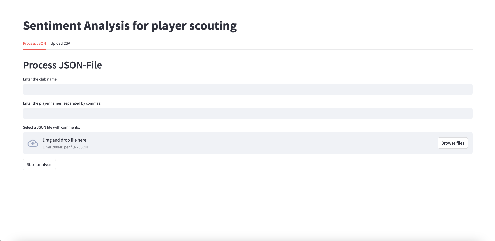
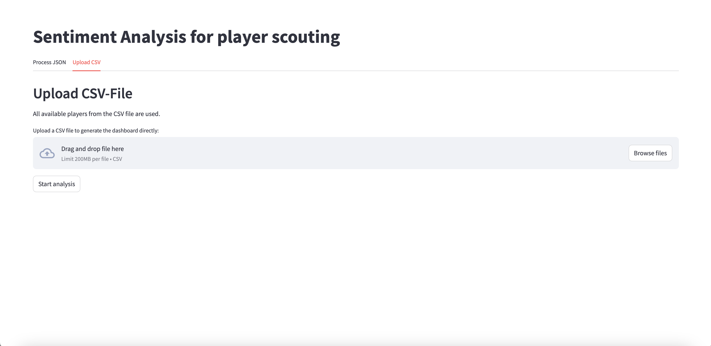
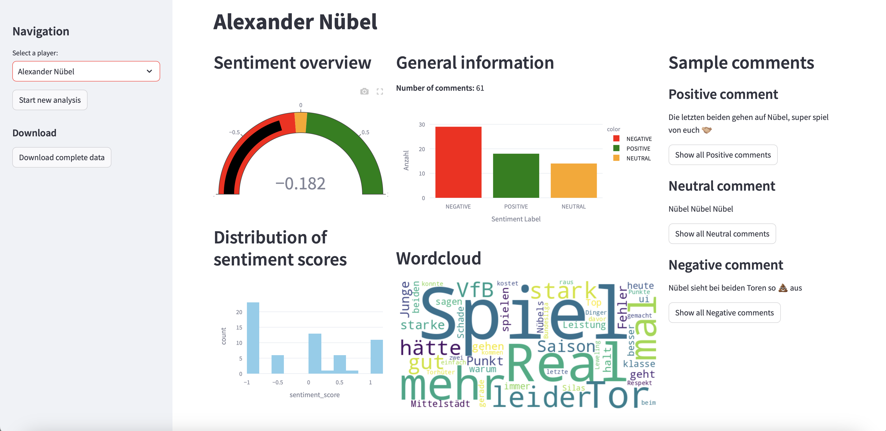
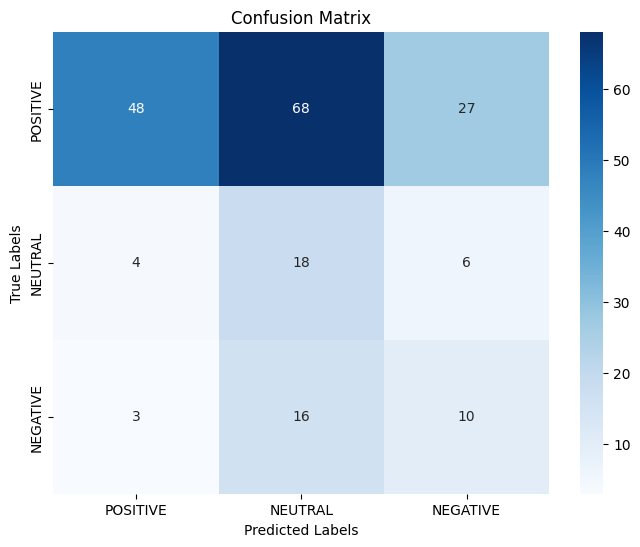
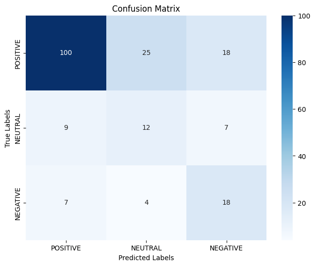
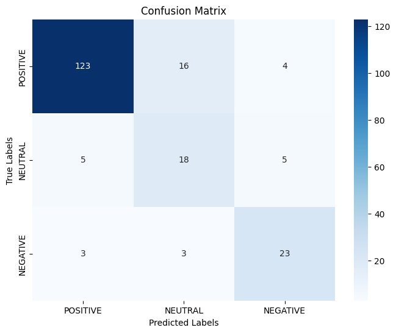

# sentiment analysis football scouting

This repository provides the code for a research project with the titel "Integrating Sentiment Analysis into Football Scouting: A Data Driven Approach".
It provides an application for the automated analysis of social media comments of football fans. The application can be run both locally and in a Docker environment. Below you will find a detailed explanation of how the project is structured, which data can be processed, and how to use the application.

---

## 1. Overview & Usage

### Purpose of the Application

This application performs **sentiment analysis** on comments from social media platforms (e.g., Instagram). It provides a **dashboard** for displaying the analyzed data. Concretely, you can:

- **Upload JSON files** containing comments (e.g., from a sports club’s Instagram posts) to analyse with GPT.


- **Perform sentiment analysis** to determine whether comments are positive, neutral, or negative
- **Upload CSV files** that have already been processed for direct display in the dashboard.


- **Visualize** data via statistics, histograms, word clouds, and sentiment-specific comment listings.



### JSON File Format

To process JSON files, the following format is expected:

```json
[
  {
    "link": "https://testurl.org/"
    "caption": "Example post description",
    "comments": [
      "Awesome match!",
      "What a goal!",
      "That lineup was terrible..."
    ]
  },
  ...
]
```

- **`link`**: A reference URL (optional).
- **`caption`**: The post description or caption.
- **`comments`**: A list of strings representing comments on this particular post.

### Additional Requirements

**.env File with OpenAI Key**  
   If you plan to use GPT-based models (e.g., GPT 4o-mini or others), you need to have your OpenAI key in a `.env` file. Create a `.env` file in the project directory (or in the appropriate location) with the following content:

   ```bash
   OPEN_API_KEY=sk-1234abcd...
   ```

   The application reads this key to call GPT functionalities. Make sure not to accidentally commit this `.env` file or make it publicly available.


### Quick Usage

1. **Local Usage**  
   - Clone the repository
   - Install the required Python packages (see [Local Deployment](#31-local-deployment))
   - Create the `.env` file (OpenAI Key)
   - Run `app.py` in the `src` directory (e.g., via `streamlit run app.py`)
   - Open the browser and navigate to the dashboard URL. From there, upload JSON/CSV files and start the analysis.

2. **Docker Usage**  
   - Build the Docker image (see [Docker Deployment](#32-docker-deployment))
   - Make sure to include the `.env` file (for the OpenAI key) when running the container
   - Run the container, then open the corresponding URL in your browser to use the dashboard.

---

## 2. Directory Structure

```
.
├── data
│   ├── instagram
│   │   └── club_instacomments.json        <-- JSON data from instagram for specific clubs
│       └── ...
│   ├── labeled
│   │   └── labeled_data.csv               <-- Labeled data for model evaluation
│       └── ...
│   └── processed
│       ├── club.csv                       <-- Example of processed CSV with sentiment analysis
│       └── ...
├── notebooks
│   ├── Data_Collection.ipynb              <-- Jupyter notebook for the example of potential web scraping
│   └── models.ipynb                       <-- Jupyter notebook for the model evaluation to perform sentiment analysis
├── src
│   ├── app.py                             <-- Main Streamlit dashboard
│   ├── preprocessing.py                   <-- Preprocessing, JSON processing, etc.
│   └── gpt.py                             <-- GPT-related functions/logic
├── requirements.txt
├── Dockerfile
└── README.md                              <-- This README file
```

- **`data/raw/`**: Contains social media data (e.g., from club pages) in JSON format.  
- **`data/labeled/`**: Contains labeled data (CSV) for evaluating model accuracy.  
- **`data/processed/`**: Contains CSV files that were generated by the application after analysis (e.g., for individual players or clubs).  
- **`notebooks/`**: Various Jupyter notebooks:
  - **`models.ipynb`**: Evaluation of different sentiment analysis models (Vader, XLM-RoBerta, GPT 4o-mini).
  - **`Create_evaluation_dataset.ipynb`**: Extracts Instagram comments from JSON files and filters them by player names to create a structured evaluation dataset.
  - **`plotting.ipynb`**: Visualizes the distribution of sentiment labels
- **`src/`**: Houses the code for the **dashboard application**.
  - **`app.py`**: Entry point for the Streamlit dashboard.
  - **`preprocessing.py`**: Functions that handle data processing (e.g., `preprocess_json`).
  - **`gpt.py`**: Logic and functions for GPT models (or GPT APIs).

---

## 3. Deployment

### 3.1 Local Deployment

1. **Clone the Repository**  
   ```bash
   git clone https://github.com/Kn3ule/sentiment-analysis-football-scouting.git
   cd sentiment-analysis-football-scouting
   ```

2. **Install Python Libraries**  
   - Ensure you have Python 3.12 installed.
   - Use a virtual environment to avoid conflicts, then install dependencies:
     ```bash
     pip install -r requirements.txt
     ```

3. **Add .env File (OpenAI Key)**  
   Create a `.env` file in the project directory:
   ```bash
   OPEN_API_KEY=sk-1234abcd...
   ```
   *(You can skip this if GPT functionality is not required.)*

4. **Run the Application**  
   ```bash
   cd src
   streamlit run app.py
   ```
   - This opens a browser window (or provides a URL in the terminal).
   - Upload JSON/CSV files in the web interface and start the analysis.

---

### 3.2 Docker Deployment

1. **Build the Docker Image**  
   If a `Dockerfile` is present, go to the root directory and run:
   ```bash
   docker build -t sentiment-app .
   ```
   *(`sentiment-app` is a freely chosen name for the image.)*

2. **Use .env**  
   To ensure your `.env` (with OPEN_API_KEY, etc.) is recognized inside the container, specify `--env-file` when you run the container:
   ```bash
   docker run -p 8501:8501 --env-file .env sentiment-app
   ```

3. **Access the Dashboard**  
   - Open your browser at `http://localhost:8501`.
   - You can then upload JSON/CSV files and use the application just as locally.

---

## 4. Model Comparison: Evaluating Sentiment Analysis Models

To determine the most suitable sentiment analysis model for this project, three different models were evaluated:

1. **Vader**: A lexicon-based sentiment analysis tool.
2. **XLM-Roberta**: A transformer-based model for multilingual text classification.
3. **GPT 4o-mini**: A lightweight version of OpenAI’s GPT model.

The models were compared using key metrics: **Accuracy**, **Precision**, **Recall**, **F1-Score**, and **Confusion Matrices**.

### Metrics and Results

Below are the evaluation results for each model on a dataset of 200 labeled comments.

### **1. Vader**

- **Accuracy**: 0.38  

**Classification Report**:
```
              precision    recall  f1-score   support

    POSITIVE       0.87      0.34      0.48       143
     NEUTRAL       0.18      0.64      0.28        28
    NEGATIVE       0.23      0.34      0.28        29

    accuracy                           0.38       200
   macro avg       0.43      0.44      0.35       200
weighted avg       0.68      0.38      0.43       200
```

**Confusion Matrix**:



**Analysis**:
- Vader performed poorly, especially for the **NEUTRAL** and **NEGATIVE** classes, where recall was below 0.35.
- The model heavily favored predicting the **POSITIVE** class, leading to imbalanced results.
- While its precision for **POSITIVE** comments is high, its low recall indicates it often failed to identify all positive comments correctly.

---

### **2. XLM-Roberta**

- **Accuracy**: 0.65  

**Classification Report**:
```
              precision    recall  f1-score   support

    POSITIVE       0.86      0.70      0.77       143
     NEUTRAL       0.29      0.43      0.35        28
    NEGATIVE       0.42      0.62      0.50        29

    accuracy                           0.65       200
   macro avg       0.52      0.58      0.54       200
weighted avg       0.72      0.65      0.67       200
```

**Confusion Matrix**:



**Analysis**:
- XLM-Roberta significantly outperformed Vader, achieving an accuracy of 65%.
- The model demonstrated a better balance across all classes, particularly with higher recall for the **NEGATIVE** class.
- However, its performance for the **NEUTRAL** class remains weak, with low precision and recall.

---

### **3. GPT 4o-mini**

- **Accuracy**: 0.82  

**Classification Report**:
```
              precision    recall  f1-score   support

    POSITIVE       0.94      0.86      0.90       143
     NEUTRAL       0.49      0.64      0.55        28
    NEGATIVE       0.72      0.79      0.75        29

    accuracy                           0.82       200
   macro avg       0.71      0.77      0.74       200
weighted avg       0.84      0.82      0.83       200
```

**Confusion Matrix**:



**Analysis**:
- GPT 4o-mini achieved the highest accuracy (82%) and demonstrated robust performance across all classes.
- It showed excellent precision and recall for the **POSITIVE** and **NEGATIVE** classes.
- While performance for the **NEUTRAL** class remains weaker, it is notably better than the other models.

---

## Key Observations:

1. **Overall Performance**:
   - GPT 4o-mini is the best-performing model, achieving the highest accuracy and balanced performance across all classes.
   - XLM-Roberta offers a middle ground but struggles with the **NEUTRAL** class.
   - Vader is unsuitable for this task, as its lexicon-based approach heavily biases predictions toward the **POSITIVE** class.

2. **Confusion Matrices**:
   - The confusion matrices reveal that GPT 4o-mini is significantly better at minimizing false negatives and false positives compared to the other models.
   - XLM-Roberta shows potential but requires further fine-tuning.

3. **Practical Implications**:
   - For the sentiment analysis task in this application, **GPT 4o-mini** is used due to its high accuracy and consistency.
